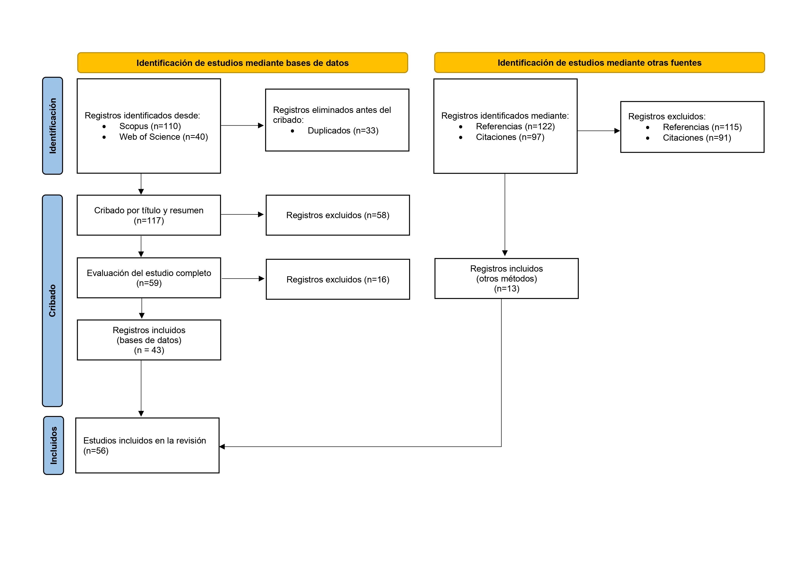

# Revisión Sistemática de Literatura

En este documento se explica el procedimiento seguido para la realización de la Revisión Sistemática de Literatura (RSL). El objetivo de esta era el de obtener un corpus de aproximadamente 50 artículos científicos para ser empleado en la fase experimental del Trabajo de Fin de Máster. 

La RSL se ha llevado a cabo siguiendo el procedimiento estándar PRISMA (*Preferred Reporting Items for Systematic Reviews and Meta-Analyses*), que establece una guía de 27 pasos y un diagrama de flujo para garantizar la transparencia, calidad y reproducibilidad del proceso.

> **Nota:** La RSL se llevó a cabo en abril de 2026. Téngase esto en cuenta a la hora de reproducir los resultados.

<br>

## 1. Pregunta de investigación

Se siguió la herramienta estándar PICO, que establece cuatro componentes para definir la pregunta de investigación.

| Componente | Descripción | Aplicación al caso |
|---|---|---|
| **P** (Población) | Datos del dominio o problema específico analizado | Grandes modelos de lenguaje (LLM) actuando como agentes en entornos de teoría de juegos |
| **I** (Intervención) | Objeto de estudio | Participación directa del LLM como jugador en juegos estratégicos |
| **C** (Comparación) | Objeto con el cual se compara la intervención principal | Soluciones teóricas clásicas (equilibrio de Nash u otros conceptos de solución), jugadores humanos y/o otros modelos o baselines de referencia |
| **O** (Resultado) | Medida de evaluación de la intervención | Comportamiento estratégico de los LLM medido mediante métricas cuantitativas |


### Formulación de la pregunta de investigación

¿Son capaces los LLM de exhibir comportamiento racional en juegos estratégicos, y cómo se compara dicho comportamiento frente a soluciones clásicas, jugadores humanos y/u otros modelos?

<br>

## 2. Criterios de selección de artículos

**Criterios de inclusión**

| Código | Criterio | Etapa de aplicación
|---|---|---|
| CI-1 | Publicado entre 2022 y 2025 | Búsqueda inicial |
| CI-2 | Artículo de revista o comunicación a congreso con revisión por pares | Búsqueda inicial |
| CI-3 | Texto en inglés | Búsqueda inicial |
| CI-4 | Involucra al menos a un LLM, o agente basado en LLM, como jugador en un juego estratégico | Cribado por título y resumen y por texto completo |
| CI-5 | Incluye comparación con soluciones clásicas, jugadores humanos y/u otros LLM o agentes basados en LLM | Cribado por título y resumen y por texto completo |
| CI-6 | Proporciona resultados cuantitativos sobre el comportamiento del LLM o agente basado en LLM | Cribado por título y resumen y por texto completo |

> **Nota:** Los criterios CI-4 y CI-5 fueron ampliados a posteriori para incluir estudios que emplearan agentes basados en LLM, no únicamente LLM tradicionales, e incluir comparaciones entre modelos, además de comparaciones frente a soluciones clásicas y/o jugadores humanos.


**Criterios de exclusión**

| Código | Criterio | Etapa de aplicación |
|---|---|---|
| CE-1 | No incluye ningún LLM (emplean agentes de aprendizaje por refuerzo u otros agentes) | Cribado por título y resumen y por texto completo |
| CE-2 | El marco de experimento es teórico, mientras que la fase experimental es secundaria o complementaria | Cribado por título y resumen y por texto completo |
| CE-3 | Revisión de literatura sin datos propios | Cribado por título y resumen y por texto completo |
| CE-4 | El juego estratégico no es el objeto central de estudio | Cribado por título y resumen y por texto completo |
| CE-5 | El texto completo no se encuentra disponible | Cribado por texto completo |
| CE-6 | Preprints sin publicación en editorial reconocida o comunicación a congresos sin revisión por pares | Corpus final |

> **Nota:** Los artículos incluidos deben de cumplir todos los criterios de inclusión, mientras que cualquier criterio de exclusión es suficiente para excluirlos. Los criterios de inclusión y exclusión fueron refinados con el modelo de lenguaje Claude Sonnet 4.6.

<br>


## 3. Búsqueda inicial en bases de datos

### Bases de datos consultadas

| Base de datos | Resultados |
|---|---|
| Scopus | 110 registros |
| Web of Science (WoS) | 40 registros |

Los registros obtenidos de Scopus se pueden consultar en `search/scopus_raw_20260407.csv`, mientras que los de Web of Science se pueden consultar en `search/wos_raw_20260407.csv`.

### Cadena de búsqueda booleana (empleada en ambas bases de datos)
```
("large language model" OR "LLM" OR "GPT" OR "ChatGPT" OR "Llama" OR "Claude"
OR "Gemini" OR "generative AI" OR "foundation model")
AND
("game theory" OR "strategic game" OR "Nash equilibrium" OR "prisoner's dilemma"
OR "bargaining" OR "auction" OR "repeated game" OR "cooperative game"
OR "mechanism design" OR "strategic interaction")
AND
("agent" OR "player" OR "rationality" OR "decision making"
OR "strategic behavior" OR "equilibrium")
```

### Filtros adicionales aplicados en Scopus
- **Años:** 2022-2025
- **Tipo de documento:** Artículos, Comunicaciones a congresos
- **Tipo de fuente:** Revistas, Actas de congresos
- **Áreas temáticas:** Informática, Matemáticas, Ciencias Sociales
- **Idioma:** Inglés

### Filtros adicionales aplicados en Web of Science
- **Años:** 01/01/2022-31/12/2025
- **Tipo de documento:** Artículos, Comunicaciones a congresos
- **Área de investigación:** Informática, Economía Empresarial
- **Idioma:** Inglés

<br>


## 4. Proceso de cribado

Se utilizó la herramienta de software <a href="https://new.rayyan.ai/">Rayyan</a> para asistir con el proceso de cribado.

### Fase 1: Eliminación de duplicados

- Registros totales antes de la deduplicación: 150 (110 Scopus y 40 WoS)
- Duplicados detectados por Rayyan: 33
- Registros únicos tras la eliminación de duplicados: 117 → Se pueden consultar en `screening/corpus_deduplicated_20260408.csv`

> **Nota:** Rayyan únicamente identificó registros duplicados, pero todas las decisiones fueron comprobadas por el revisor.

### Fase 2: Cribado por título y resumen

- Registros sometidos a cribado por título y resumen: 117
- Registros excluidos: 58
- Registros incluidos: 59 → Se pueden consultar en `screening/corpus_title_abstract_20260412.csv`

> **Nota:** Rayyan no incluyó o excluyó ningún registro automáticamente, luego todas las decisiones recayeron en el revisor. Adicionalmente, se empleó el modelo de lenguaje Claude Sonnet 4.6 como asistente adicional en algunas decisiones. Al realizar el cribado mediante un único revisor, se asumen errores en la clasificación de registros durante esta fase. Esto se intentó mitigar parcialmente incluyendo citas y referencias de los artículos más relevantes del corpus final.


### Fase 3: Cribado por lectura de texto completo

- Registros sometidos a cribado por lectura de texto completo: 59
- Registros excluidos: 16
- Registros incluidos: 43 → Se pueden consultar en `screening/corpus_fulltext_20260414.csv`

> **Nota:** Durante esta fase se identificó un registro duplicado que no fue detectado por Rayyan previamente.

<br>

## 5. Búsqueda en fuentes adicionales

Para mitigar posibles fallos en la clasificación de artículos durante el cribado y reforzar la búsqueda, se realizó una búsqueda hacia atrás y hacia delante sobre los siete registros con mayor número de citas y mayor relevancia temática del corpus. Estos fueron:

- **R1:** Alekseenko, I., Dagaev, D., Paklina, S., y Parshakov, P. (2025). Strategizing with AI: Insights from a beauty contest experiment. Journal of Economic Behavior & Organization, 240, Article C. https://doi.org/10.1016/j.jebo.2025.106924

- **R2:** Brookins, P., y DeBacker, J. M. (2024). Playing games with GPT: What can we learn about a large language model from canonical strategic games? Economics Bulletin, 44(1), 25–37.

- **R3:** Duan, J., Zhang, R., Diffenderfer, J., Kailkhura, B., Sun, L., Stengel-Eskin, E., Bansal, M., Chen, T., y Xu, K. (2024). GTBench: Uncovering the strategic reasoning limitations of LLMs via game-theoretic evaluations. En Advances in Neural Information Processing Systems (Vol. 37). Curran Associates.
  
- **R4:** Fan, C., Chen, J., Jin, Y., y He, H. (2024). Can large language models serve as rational players in game theory? A systematic analysis. En Proceedings of the AAAI Conference on Artificial Intelligence (Vol. 38, n.º 16, pp. 17960–17967). AAAI Press. https://doi.org/10.1609/aaai.v38i16.29729
  
- **R5:** Mao, S., Cai, Y., Xia, Y., Wu, W., Wang, X., Wang, F., Guan, Q., Ge, T., y Wei, F. (2025). ALYMPICS: LLM agents meet game theory. En Proceedings of the 31st International Conference on Computational Linguistics (pp. 2845–2866). Association for Computational Linguistics.

- **R6:** Park, C., Liu, X., Ozdaglar, A. E., y Zhang, K. (2024). Do LLM agents have regret? A case study in online learning and games. En LLMAgents Workshop at ICLR 2024. https://arxiv.org/abs/2403.16843
  
- **R7:** Piatti, G., Jin, Z., Kleiman-Weiner, M., Schölkopf, B., Sachan, M., y Mihalcea, R. (2024). Cooperate or collapse: Emergence of sustainable cooperation in a society of LLM agents. En Advances in Neural Information Processing Systems (Vol. 37). Curran Associates.

### Búsqueda hacia delante

Se identificaron todas las citaciones disponibles en Scopus de cada registro, y se aplicaron los filtros iniciales y la cadena de búsqueda booleana descritos en la sección 3. A los registros restantes se les aplicó un cribado por título y resumen, siguiendo los criterios de inclusión y exclusión previamente definidos.

| Registro | Citaciones evaluadas | Citaciones incluidas al corpus |
|---|---|---|
| R3 | 63 | 6 |
| Can LLMs Serve as Rational Players | 40 | 0 |
| Playing games with GPT | 19 | 0 |

### Búsqueda hacia atrás

En este caso se analizaron todas las referencias de los artículos, aplicándoles un cribado por título y resumen con los criterios de inclusión y exclusión ya definidos.

| Registro | Referencias evaluadas | Referencias incluidas al corpus |
|---|---|---|
| R2 | 19 | 0 |
| R3 | 63 | 6 |
| R4 | 40 | 0 |

> **Nota:** El proceso de búsqueda hacia atrás se dio por concluido debido a que (1) se analizaron dos registros consecutivos (R2 y R4) sin añadir ninguna referencia nueva y (2) varias referencias de los registros ya estaban incluidas en el corpus.

### Resultados

- Registros adicionales identificados de otras fuentes: 122 referencias y 97 citaciones
- Registros excluidos: 115 referencias y 91 citaciones
- Registros incluidos: 13 → Las referencias y citaciones incluidas se pueden consultar en `search_references_20260415.csv` y `search_citations_20260415.csv`

<br> 


## 6. Corpus final

- Registros incluidos mediante bases de datos: 43
- Registros incluidos mediante otras fuentes: 13
- Total de registros incluidos en el corpus: 56 → El corpus final se puede consultar en `final/corpus_final_20260415.csv`

<br>


## 7. Diagrama de flujo PRISMA




*Figura 1.* Diagrama de flujo PRISMA 2020 (Versión para revisiones que incluyen búsquedas en bases de datos y otras fuentes). Adaptado de https://www.prisma-statement.org/prisma-2020-flow-diagram.
